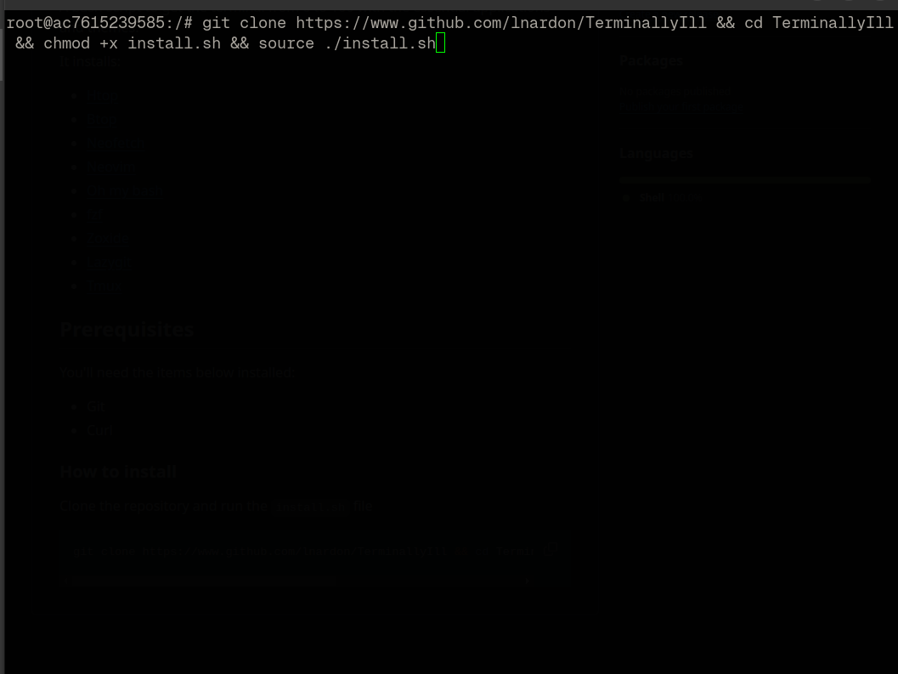
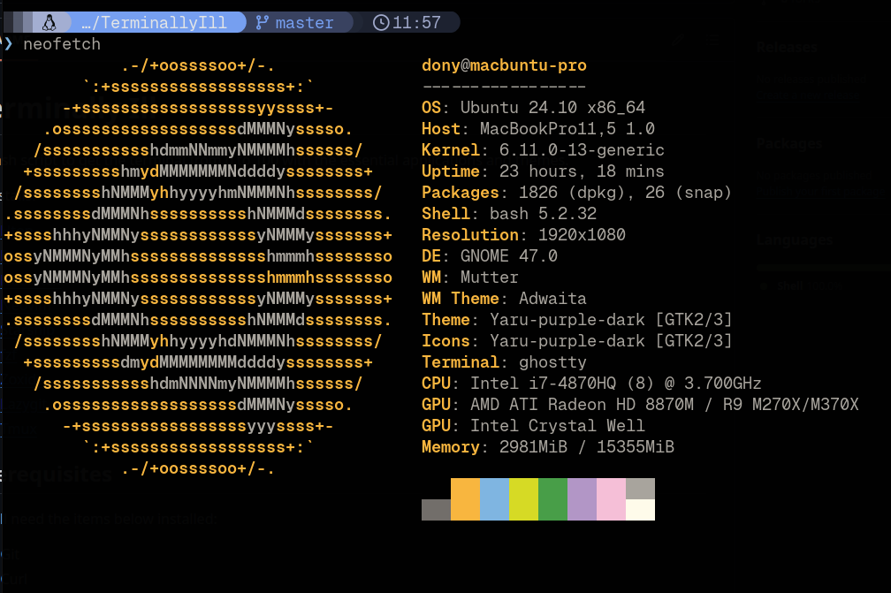

# Terminally Ill
A bash script to get the terminal from 0 to 100 with the essential applications and themes. 

It installs:
- [Htop](https://github.com/htop-dev/htop)
- [Btop](https://github.com/aristocratos/btop)
- [Neofetch](https://github.com/dylanaraps/neofetch)
- [Neovim](https://github.com/neovim/neovim)
- [Starship](https://github.com/starship/starship)
- [fzf](https://github.com/junegunn/fzf)
- [Zoxide](https://github.com/ajeetdsouza/zoxide)
- [Lazygit](https://github.com/jesseduffield/lazygit)
- [Tmux](https://github.com/tmux/tmux)

## Prerequisites
You'll need the items below installed:
 - Git
 - Curl

### How to install
Clone the repository and run the `install.sh` file
```bash
git clone https://www.github.com/lnardon/TerminallyIll && cd TerminallyIll && chmod +x install.sh && source ./install.sh
```

#### Before


#### After


